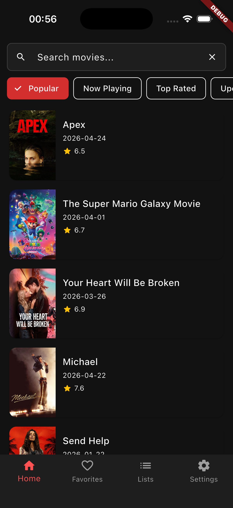

# Movie Tracker



## Objective
Practice theories

Everything is on progress, everything is ongoing.

## How to run
1. Clone the project
2. Create a file `.env` with
```
TMDB_API_KEY=<TMDB_KEY>
```
3. Run with `./mrun`

## Roadmap
This project is far from done; I still want to:
- [ ] Add authentication methods (W/ Firebase)
- [ ] Add capability to create custom lists
- [ ] Add favorites page
- [ ] Add settings page
- [ ] Add capability to share lists between friends
- [ ] Add capability to randomly pick a movie from one (or more) of your lists, like a "Feeling lucky" option.
- [ ] Make offline first app
- [ ] Create a custom design system
- [ ] Add fancy animations
- [ ] Add support to TV series

## Other infos
Have fun
